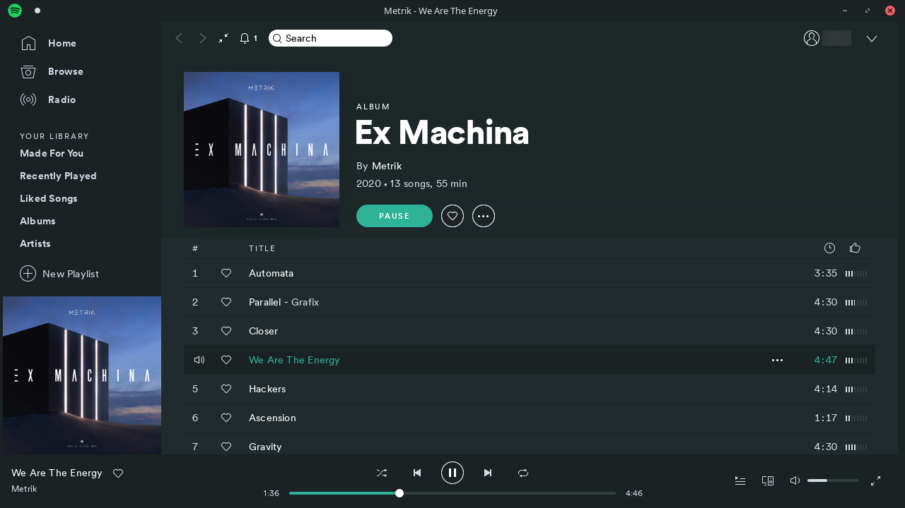
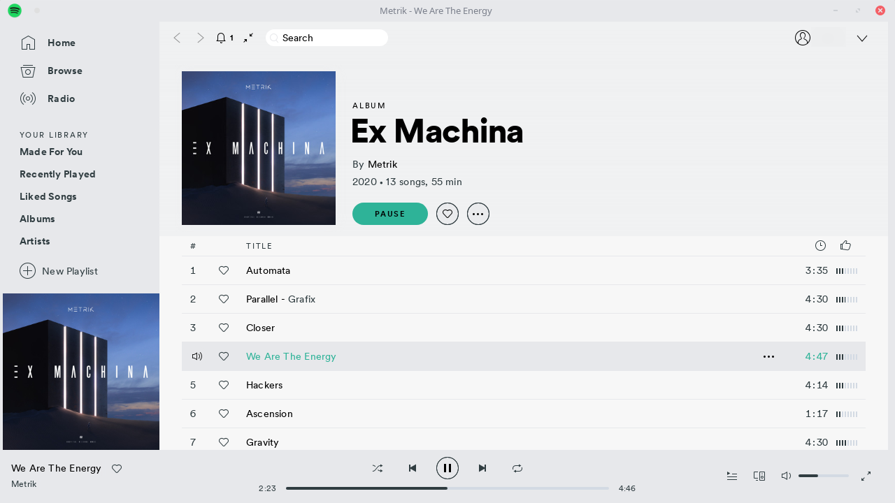

# Matcha

Colour theme inspired by [Matcha GTK theme](https://github.com/vinceliuice/Matcha-gtk-theme)

Has a dark (base) and a light variant and narrow scroll bar tweak.

## Screenshots




## Requirements

This theme requires [spicetify](https://github.com/khanhas/spicetify-cli) in order to be installed.

## Installation

```
git clone https://github.com/jwty/Matcha-Spotify-Theme
mv Matcha-Spotify-Theme ~/.config/spicetify/Themes/
spicetify config current_theme Matcha-Spotify-Theme
spicetify apply
```

For light variant run `spicetify config color_scheme Light` before `spicetify apply`.
